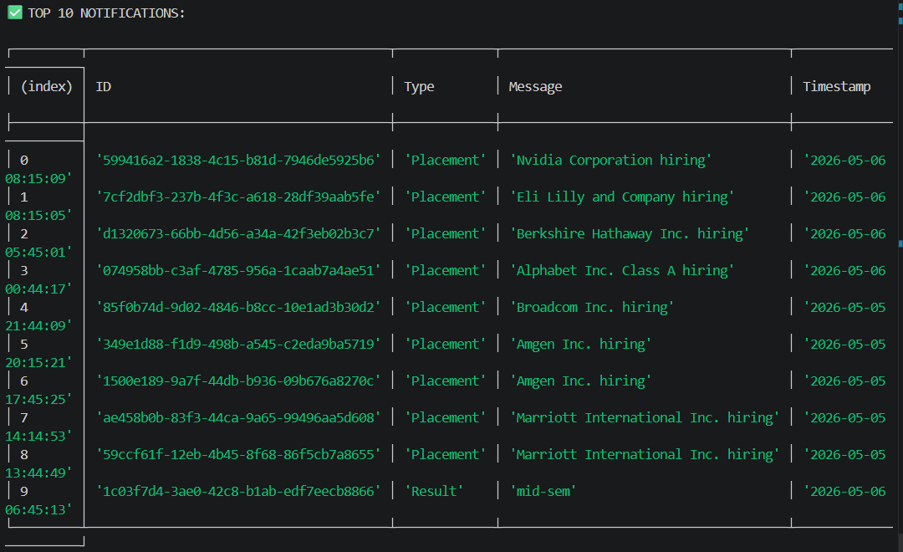

# Stage 1

## Problem
Users are missing important notifications due to high volume.

## Solution
We implemented a Priority Inbox that shows top 10 important unread notifications.

## Priority Logic
We assign weights:
- Placement = 3
- Result = 2
- Event = 1

Then sort by:
1. Priority (descending)
2. Timestamp (latest first)

## Approach
1. Fetch notifications from API
2. Assign priority using map
3. Sort notifications
4. Take top 10

## Efficient Approach
To maintain top 10 efficiently:
- Use Min Heap (size = 10)
- Time Complexity: O(n log k)

## Output Screenshot
